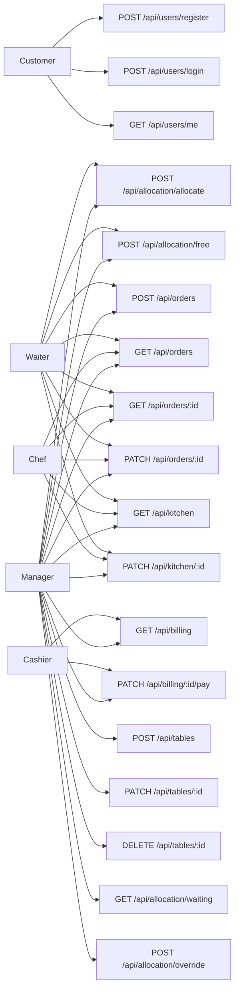
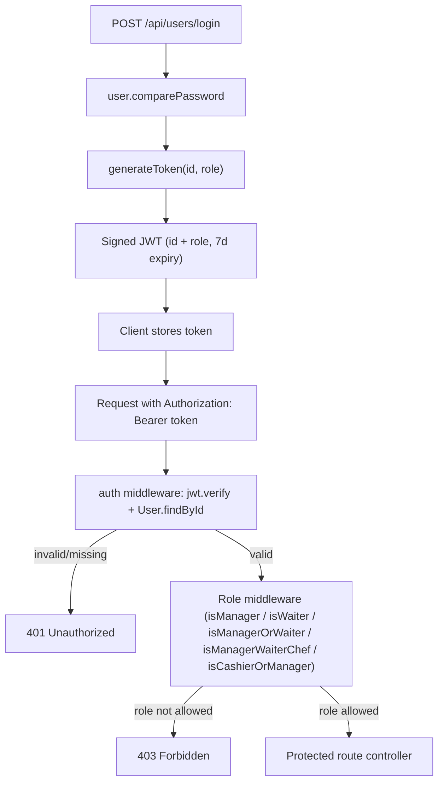

```markdown
# RestOps Architecture
## this is old one, needs to be updated
## 1. Project Overview
RestOps is a Node.js/Express backend for restaurant operations management, backed by MongoDB via Mongoose. It covers user authentication, table management, table allocation with a FIFO waiting queue, order lifecycle, kitchen workflow, and billing/payment. This repository contains **backend only** — no frontend/client code is present.

## 2. Technology Stack
- **Runtime/Framework:** Node.js, Express.js
- **Database:** MongoDB, accessed via Mongoose ODM
- **Auth:** JSON Web Tokens (`jsonwebtoken`)
- **Password hashing:** `bcrypt`
- **Config:** `dotenv` (environment variables, e.g. `MONGO_URI`, `JWT_SECRET`)

## 3. Folder Structure
```
server.js                        - App entrypoint, DB connect, router mounting
config/
  db.js                          - mongoose.connect(process.env.MONGO_URI)
routes/
  userRoutes.js
  tableRoutes.js
  orderRoutes.js
  kitchenRoutes.js
  billingRoutes.js
  allocationRoutes.js
controllers/
  userController.js
  tableController.js
  orderController.js
  kitchenController.js
  billingController.js
  allocationController.js
services/
  allocationService.js           - Only domain with a dedicated service layer
middleware/
  auth.js                        - auth + 6 role-check middlewares
models/
  User.js
  Table.js
  Order.js
  WaitingQueue.js
```

## 4. User Roles
Defined in the `User` schema enum: `customer`, `waiter`, `chef`, `cashier`, `manager` (default: `customer`).

- **customer** — registers, logs in, views own profile only.
- **waiter** — allocates/frees tables, creates orders, views/updates orders and kitchen status.
- **chef** — views kitchen queue, updates preparation status, views/updates orders.
- **cashier** — views pending bills, marks bills as paid.
- **manager** — superuser role; every role-check middleware that allows a specific role also allows `manager`. Additionally, only `manager` can do table CRUD, view the waiting queue, and perform manager override (table combination).

## 5. Complete Feature Inventory

| Feature | Role(s) | Route(s) | Middleware | Controller | Service | Model |
|---|---|---|---|---|---|---|
| Register | Any (public) | `POST /api/users/register` | None | `registerUser` | None | `User` |
| Login | Any (public) | `POST /api/users/login` | None | `loginUser` | None | `User` |
| Get own profile | Any authenticated | `GET /api/users/me` | `auth` | `getMe` | None | None (`req.user`) |
| Create table | manager | `POST /api/tables` | `auth, isManager` | `createTable` | None | `Table` |
| Update table | manager | `PATCH /api/tables/:id` | `auth, isManager` | `updateTable` | None | `Table` |
| Delete table | manager | `DELETE /api/tables/:id` | `auth, isManager` | `deleteTable` | None | `Table` |
| List tables | any authenticated | `GET /api/tables` | `auth` | `getTables` | None | `Table` |
| Get single table | any authenticated | `GET /api/tables/:id` | `auth` | `getTable` | None | `Table` |
| Create order | manager, waiter | `POST /api/orders` | `auth, isManagerOrWaiter` | `createOrder` | None | `Order`, `Table` |
| List orders | manager, waiter, chef | `GET /api/orders` | `auth, isManagerWaiterChef` | `getOrders` | None | `Order` |
| Get single order | manager, waiter, chef | `GET /api/orders/:id` | `auth, isManagerWaiterChef` | `getOrder` | None | `Order` |
| Update order status | manager, waiter, chef | `PATCH /api/orders/:id` | `auth, isManagerWaiterChef` | `updateStatus` | None | `Order`, `Table` |
| View kitchen queue | manager, waiter, chef | `GET /api/kitchen` | `auth, isManagerWaiterChef` | `getKitchenOrders` | None | `Order` |
| Update kitchen status | manager, waiter, chef | `PATCH /api/kitchen/:id` | `auth, isManagerWaiterChef` | `updateKitchenStatus` | None | `Order` |
| View pending bills | cashier, manager | `GET /api/billing` | `auth, isCashierOrManager` | `getPendingBills` | None | `Order` |
| Mark bill paid | cashier, manager | `PATCH /api/billing/:id/pay` | `auth, isCashierOrManager` | `markPaid` | None | `Order`, `Table` |
| Allocate table | waiter, manager | `POST /api/allocation/allocate` | `auth, isWaiter` | `allocateTable` | `allocateTableService` | `Table`, `WaitingQueue` |
| Free table | waiter, manager | `POST /api/allocation/free` | `auth, isWaiter` | `freeTable` | `freeTableService` | `Table`, `WaitingQueue` |
| View waiting queue | manager | `GET /api/allocation/waiting` | `auth, isManager` | `getWaitingQueue` | `viewWaitingQueue` | `WaitingQueue` |
| Manager override (combine tables) | manager | `POST /api/allocation/override` | `auth, isManager` | `managerOverride` | `managerOverrideAllocate` | `Table` |

## 6. Role × Feature Access Matrix

| Feature | Customer | Waiter | Chef | Cashier | Manager |
|---|:---:|:---:|:---:|:---:|:---:|
| Register / Login / Me | ✅ | ✅ | ✅ | ✅ | ✅ |
| Table CRUD (create/update/delete) | ❌ | ❌ | ❌ | ❌ | ✅ |
| View tables | ✅ | ✅ | ✅ | ✅ | ✅ |
| Create order | ❌ | ✅ | ❌ | ❌ | ✅ |
| View/update orders | ❌ | ✅ | ✅ | ❌ | ✅ |
| Kitchen view/update | ❌ | ✅ | ✅ | ❌ | ✅ |
| Billing view/pay | ❌ | ❌ | ❌ | ✅ | ✅ |
| Allocate/free table | ❌ | ✅ | ❌ | ❌ | ✅ |
| Waiting queue view | ❌ | ❌ | ❌ | ❌ | ✅ |
| Manager override (combine tables) | ❌ | ❌ | ❌ | ❌ | ✅ |

Note: "Manager" column is ✅ everywhere because every role-check middleware in this codebase (`isManager`, `isManagerOrWaiter`, `isManagerWaiterChef`, `isCashierOrManager`, `isWaiter`) explicitly includes `"manager"` in its allowed roles.

## 7. Every API Endpoint

### `/api/users` (mounted in `server.js`, router: `routes/userRoutes.js`)
- `POST /register` — public
- `POST /login` — public
- `GET /me` — `auth` — any authenticated user

### `/api/tables` (router: `routes/tableRoutes.js`)
- `POST /` — `auth, isManager` — manager
- `PATCH /:id` — `auth, isManager` — manager
- `DELETE /:id` — `auth, isManager` — manager
- `GET /` — `auth` — any authenticated user
- `GET /:id` — `auth` — any authenticated user

### `/api/orders` (router: `routes/orderRoutes.js`)
- `POST /` — `auth, isManagerOrWaiter` — manager, waiter
- `GET /` — `auth, isManagerWaiterChef` — manager, waiter, chef
- `GET /:id` — `auth, isManagerWaiterChef` — manager, waiter, chef
- `PATCH /:id` — `auth, isManagerWaiterChef` — manager, waiter, chef

### `/api/kitchen` (router: `routes/kitchenRoutes.js`)
- `GET /` — `auth, isManagerWaiterChef` — manager, waiter, chef
- `PATCH /:id` — `auth, isManagerWaiterChef` — manager, waiter, chef

### `/api/billing` (router: `routes/billingRoutes.js`)
- `GET /` — `auth, isCashierOrManager` — cashier, manager
- `PATCH /:id/pay` — `auth, isCashierOrManager` — cashier, manager

### `/api/allocation` (router: `routes/allocationRoutes.js`)
- `POST /allocate` — `auth, isWaiter` — waiter, manager
- `POST /free` — `auth, isWaiter` — waiter, manager
- `GET /waiting` — `auth, isManager` — manager
- `POST /override` — `auth, isManager` — manager

All routers are mounted in `server.js`:
```
app.use("/api/users", userRoutes);
app.use("/api/tables", tableRoutes);
app.use("/api/orders", orderRoutes);
app.use("/api/kitchen", kitchenRoutes);
app.use("/api/billing", billingRoutes);
app.use("/api/allocation", allocationRoutes);
```

## 8. Route → Middleware → Controller → Service → Model → DB Mapping

| Method + Path | Middleware | Controller | Service | Model | DB Operation |
|---|---|---|---|---|---|
| `POST /api/users/register` | None | `registerUser` | None | `User` | `User.findOne`, `User.create` |
| `POST /api/users/login` | None | `loginUser` | None | `User` | `User.findOne`, `comparePassword` |
| `GET /api/users/me` | `auth` | `getMe` | None | None | reads `req.user` (from `User.findById` in `auth`) |
| `POST /api/tables` | `auth, isManager` | `createTable` | None | `Table` | `Table.findOne`, `Table.create` |
| `PATCH /api/tables/:id` | `auth, isManager` | `updateTable` | None | `Table` | `Table.findByIdAndUpdate` |
| `DELETE /api/tables/:id` | `auth, isManager` | `deleteTable` | None | `Table` | `Table.findByIdAndDelete` |
| `GET /api/tables` | `auth` | `getTables` | None | `Table` | `Table.find` |
| `GET /api/tables/:id` | `auth` | `getTable` | None | `Table` | `Table.findById` |
| `POST /api/orders` | `auth, isManagerOrWaiter` | `createOrder` | None | `Order`, `Table` | `Table.findById`, `Order.create`, `table.save` |
| `GET /api/orders` | `auth, isManagerWaiterChef` | `getOrders` | None | `Order` | `Order.find().populate("table").populate("customer")` |
| `GET /api/orders/:id` | `auth, isManagerWaiterChef` | `getOrder` | None | `Order` | `Order.findById().populate(...)` |
| `PATCH /api/orders/:id` | `auth, isManagerWaiterChef` | `updateStatus` | None | `Order`, `Table` | `Order.findById`, `order.save`, and `table.save` if `status === "completed"` |
| `GET /api/kitchen` | `auth, isManagerWaiterChef` | `getKitchenOrders` | None | `Order` | `Order.find({status: {$in: ["pending","preparing"]}}).populate("table")` |
| `PATCH /api/kitchen/:id` | `auth, isManagerWaiterChef` | `updateKitchenStatus` | None | `Order` | validates status in `["preparing","ready"]`, `Order.findById`, `order.save` |
| `GET /api/billing` | `auth, isCashierOrManager` | `getPendingBills` | None | `Order` | `Order.find({status:"completed", paidStatus:"unpaid"}).populate("table")` |
| `PATCH /api/billing/:id/pay` | `auth, isCashierOrManager` | `markPaid` | None | `Order`, `Table` | `Order.findById`, sets `paidStatus/paymentMethod/paidAt`, `order.save`, then frees `table` |
| `POST /api/allocation/allocate` | `auth, isWaiter` | `allocateTable` | `allocateTableService` | `Table`, `WaitingQueue` | `Table.findOne` (smallest fit), `table.save`, or `WaitingQueue.create` |
| `POST /api/allocation/free` | `auth, isWaiter` | `freeTable` | `freeTableService` | `Table`, `WaitingQueue` | `Table.findById`, `table.save`, scans `WaitingQueue.find`, auto-assigns |
| `GET /api/allocation/waiting` | `auth, isManager` | `getWaitingQueue` | `viewWaitingQueue` | `WaitingQueue` | `WaitingQueue.find({status:"waiting"}).sort({createdAt:1})` |
| `POST /api/allocation/override` | `auth, isManager` | `managerOverride` | `managerOverrideAllocate` | `Table` | `Table.find({status:"available"}).sort`, combines capacities, `table.save` on each |

## 9. Complete Middleware Map

All defined in `middleware/auth.js`.

| Middleware | Checks | Allowed Roles | Routes Using It |
|---|---|---|---|
| `auth` | Extracts Bearer token, `jwt.verify(token, process.env.JWT_SECRET)`, loads `req.user = User.findById(decoded.id).select("-password")`; 401 if missing/invalid/user not found | Any valid token holder | Every protected route in all 6 route files |
| `isManager` | `req.user.role !== "manager"` → 403 | manager | `tableRoutes` (POST/PATCH/DELETE), `allocationRoutes` (`/waiting`, `/override`) |
| `isManagerOrWaiter` | role in `["manager","waiter"]` | manager, waiter | `orderRoutes` (`POST /`) |
| `isKitchenStaff` | role in `["chef","manager"]` | chef, manager | **UNUSED — dead code. Not imported/referenced by any route file in the repository.** |
| `isManagerWaiterChef` | role in `["manager","waiter","chef"]` | manager, waiter, chef | `orderRoutes` (GET/PATCH), `kitchenRoutes` (GET/PATCH) |
| `isCashierOrManager` | role in `["cashier","manager"]` | cashier, manager | `billingRoutes` (GET, PATCH `/:id/pay`) |
| `isWaiter` | role in `["waiter","manager"]` | waiter, manager | `allocationRoutes` (`/allocate`, `/free`) |

## 10. Authentication and Authorization Flow

1. **Register:** `POST /api/users/register` → `registerUser` checks `User.findOne({email})` for duplicates, then `User.create(...)`. The `User` schema's `pre("save")` hook bcrypt-hashes the password (`bcrypt.genSalt(10)` + `bcrypt.hash`) automatically before the document is written.
2. **Login:** `POST /api/users/login` → `loginUser` finds the user by email, calls `user.comparePassword(password)` (bcrypt compare), and on success calls `generateToken(user._id, user.role)` to sign a JWT (role embedded in the token) using `process.env.JWT_SECRET`.
3. **Protected request:** client sends `Authorization: Bearer <token>`. The `auth` middleware extracts the token, verifies it with `jwt.verify`, and reloads the user via `User.findById(decoded.id).select("-password")` into `req.user`. Missing/invalid token or missing user → 401.
4. **Role authorization:** after `auth`, a role-specific middleware (e.g. `isManager`, `isWaiter`, `isManagerWaiterChef`, `isCashierOrManager`, `isManagerOrWaiter`) checks `req.user.role` against an allow-list, returning 403 if not permitted.
5. **`GET /api/users/me`** simply returns `req.user`, populated entirely by `auth` — no extra controller logic.

## 11. Models and Relationships

### `User` (`models/User.js`)
- `name` (String, required)
- `email` (String, required, unique, lowercase)
- `password` (String, required, min length 6, bcrypt-hashed on save)
- `role` (enum: `customer`, `waiter`, `chef`, `cashier`, `manager`; default `customer`)
- `phone` (String)
- `createdAt` (Date, default now)
- Instance method: `comparePassword(candidatePassword)`

### `Table` (`models/Table.js`)
- `number` (Number, required, unique)
- `capacity` (Number, required)
- `status` (enum: `available`, `reserved`, `occupied`, `cleaning`; default `available`)
- `currentOrder` (ObjectId ref `Order`, default null)
- `createdAt` (Date, default now)

### `Order` (`models/Order.js`)
- `table` (ObjectId ref `Table`, required)
- `customer` (ObjectId ref `User`, default null)
- `items` (array of `{name, price, quantity}`)
- `status` (enum: `pending`, `preparing`, `ready`, `served`, `completed`; default `pending`)
- `totalAmount`, `taxAmount`, `finalBill` (Numbers, default 0)
- `paidStatus` (enum: `unpaid`, `paid`; default `unpaid`)
- `paymentMethod` (enum: `cash`, `card`, `upi`, `null`; default `null`)
- `paidAt` (Date, default null)
- `createdAt` (Date, default now)

### `WaitingQueue` (`models/WaitingQueue.js`)
- `groupSize` (Number, required)
- `status` (enum: `waiting`, `allocated`, `cancelled`; default `waiting`)
- `createdAt` (Date, default now)

**Relationships:** `Order.table` → `Table`; `Order.customer` → `User`; `Table.currentOrder` → `Order`. `WaitingQueue` has no direct ref field to `Table`/`User` — it is matched by `groupSize` and FIFO order (`createdAt`) in `services/allocationService.js`.

## 12. Business Workflows

### Table Allocation → Waiting Queue
`allocateTableService(groupSize)`:
1. Finds the **smallest available table** with `capacity >= groupSize` (`Table.findOne({status:"available", capacity:{$gte:groupSize}}).sort({capacity:1})`).
2. If found: mark `occupied`, return `{status:"allocated", tableId, capacity}`.
3. If not found: check if any table exists with enough capacity at all (`biggestTable.capacity < groupSize` → `{status:"manager_required"}`, prompting a manager override).
4. Otherwise: create a `WaitingQueue` entry and compute the group's FIFO position via `countDocuments` of earlier waiting entries.

### Freeing a Table
`freeTableService(tableId)`:
1. Sets the table's `status` to `available`.
2. Scans the `WaitingQueue` in FIFO order (`sort({createdAt:1})`).
3. For each waiting group, looks for a suitable now-available table; if found, occupies it and marks the queue entry `allocated`, returning immediately (first-fit FIFO drain).
4. If no waiting group fits, returns `{freed:true, allocated:false}`.

### Manager Override (Table Combination)
`managerOverrideAllocate(groupSize)`:
1. Fetches all available tables sorted by capacity descending.
2. Greedily adds tables to a `selected` list, accumulating `totalCap`, until `totalCap >= groupSize`.
3. If total capacity across all available tables is still insufficient, returns failure.
4. Otherwise marks each selected table `occupied` and returns the combined assignment.

### Order Creation → Kitchen → Completion → Billing
1. `createOrder`: validates the table exists, computes `total`, `tax` (5% GST), `finalBill = total + tax`, creates the `Order`, and marks the `Table` as `occupied` with `currentOrder` set.
2. Kitchen views orders with `status` in `["pending","preparing"]` (`getKitchenOrders`) and updates status to `"preparing"` or `"ready"` only (`updateKitchenStatus` rejects other values).
3. `updateStatus` (generic order status update) additionally frees the table when `status === "completed"` (`table.status = "available"`, `table.currentOrder = null`).
4. Billing (`getPendingBills`) lists orders where `status:"completed"` and `paidStatus:"unpaid"`.
5. `markPaid` sets `paidStatus:"paid"`, `paymentMethod`, `paidAt`, rejects if already paid, and additionally frees the table again as a safeguard (`table.status = "available"`, `table.currentOrder = null`).

## 13. File Dependency Map

| File | Purpose | Imports/Uses | Used By |
|---|---|---|---|
| `server.js` | App entrypoint; connects DB, mounts all routers | `dotenv`, `express`, `config/db.js`, all 6 `routes/*.js` | Node runtime (main file) |
| `config/db.js` | MongoDB connection | `mongoose` | `server.js` |
| `routes/userRoutes.js` | Defines `/api/users` endpoints | `controllers/userController.js`, `middleware/auth.js` (`auth`) | `server.js` |
| `routes/tableRoutes.js` | Defines `/api/tables` endpoints | `controllers/tableController.js`, `middleware/auth.js` (`auth`, `isManager`) | `server.js` |
| `routes/orderRoutes.js` | Defines `/api/orders` endpoints | `controllers/orderController.js`, `middleware/auth.js` (`auth`, `isManagerOrWaiter`, `isManagerWaiterChef`) | `server.js` |
| `routes/kitchenRoutes.js` | Defines `/api/kitchen` endpoints | `controllers/kitchenController.js`, `middleware/auth.js` (`auth`, `isManagerWaiterChef`) | `server.js` |
| `routes/billingRoutes.js` | Defines `/api/billing` endpoints | `controllers/billingController.js`, `middleware/auth.js` (`auth`, `isCashierOrManager`) | `server.js` |
| `routes/allocationRoutes.js` | Defines `/api/allocation` endpoints | `controllers/allocationController.js`, `middleware/auth.js` (`auth`, `isManager`, `isWaiter`) | `server.js` |
| `controllers/userController.js` | Register/login/getMe logic | `models/User.js`, `jsonwebtoken` (for `generateToken`) | `routes/userRoutes.js` |
| `controllers/tableController.js` | Table CRUD logic | `models/Table.js` | `routes/tableRoutes.js` |
| `controllers/orderController.js` | Order create/list/update logic | `models/Order.js`, `models/Table.js` | `routes/orderRoutes.js` |
| `controllers/kitchenController.js` | Kitchen queue view/update logic | `models/Order.js` | `routes/kitchenRoutes.js` |
| `controllers/billingController.js` | Pending bills/payment logic | `models/Order.js`, `models/Table.js` | `routes/billingRoutes.js` |
| `controllers/allocationController.js` | Thin wrapper delegating to service layer | `services/allocationService.js` | `routes/allocationRoutes.js` |
| `services/allocationService.js` | Allocation/free/queue/override business logic | `models/Table.js`, `models/WaitingQueue.js` | `controllers/allocationController.js` |
| `middleware/auth.js` | JWT auth + 6 role-check middlewares | `jsonwebtoken`, `models/User.js` | All route files |
| `models/User.js` | User schema, password hashing, `comparePassword` | `mongoose`, `bcrypt` | `controllers/userController.js`, `middleware/auth.js` |
| `models/Table.js` | Table schema | `mongoose` | `controllers/tableController.js`, `controllers/orderController.js`, `controllers/billingController.js`, `services/allocationService.js` |
| `models/Order.js` | Order schema | `mongoose` | `controllers/orderController.js`, `controllers/kitchenController.js`, `controllers/billingController.js` |
| `models/WaitingQueue.js` | Waiting queue schema | `mongoose` | `services/allocationService.js` |

## 14. Mermaid Architecture Diagrams

### A. Complete Route → Middleware → Controller → Service → Model → MongoDB

```mermaid
graph TD
  subgraph Users
    U1["POST /api/users/register"] --> C1["registerUser"] --> M1["User.create"]
    U2["POST /api/users/login"] --> C2["loginUser"] --> M2["User.findOne + comparePassword"]
    U3["GET /api/users/me (auth)"] --> C3["getMe"] --> M3["req.user"]
  end

  subgraph Tables
    T1["POST /api/tables (auth,isManager)"] --> C4["createTable"] --> M4["Table.create"]
    T2["PATCH /api/tables/:id (auth,isManager)"] --> C5["updateTable"] --> M5["Table.findByIdAndUpdate"]
    T3["DELETE /api/tables/:id (auth,isManager)"] --> C6["deleteTable"] --> M6["Table.findByIdAndDelete"]
    T4["GET /api/tables (auth)"] --> C7["getTables"] --> M7["Table.find"]
    T5["GET /api/tables/:id (auth)"] --> C8["getTable"] --> M8["Table.findById"]
  end

  subgraph Orders
    O1["POST /api/orders (auth,isManagerOrWaiter)"] --> C9["createOrder"] --> M9["Order.create + Table.save"]
    O2["GET /api/orders (auth,isManagerWaiterChef)"] --> C10["getOrders"] --> M10["Order.find.populate"]
    O3["GET /api/orders/:id"] --> C11["getOrder"] --> M11["Order.findById.populate"]
    O4["PATCH /api/orders/:id"] --> C12["updateStatus"] --> M12["Order.save + Table.save if completed"]
  end

  subgraph Kitchen
    K1["GET /api/kitchen (auth,isManagerWaiterChef)"] --> C13["getKitchenOrders"] --> M13["Order.find status pending/preparing"]
    K2["PATCH /api/kitchen/:id"] --> C14["updateKitchenStatus"] --> M14["Order.save"]
  end

  subgraph Billing
    B1["GET /api/billing (auth,isCashierOrManager)"] --> C15["getPendingBills"] --> M15["Order.find status completed paidStatus unpaid"]
    B2["PATCH /api/billing/:id/pay"] --> C16["markPaid"] --> M16["Order.save + Table.save"]
  end

  subgraph Allocation
    A1["POST /api/allocation/allocate (auth,isWaiter)"] --> C17["allocateTable"] --> S1["allocateTableService"] --> M17["Table.findOne/save + WaitingQueue.create"]
    A2["POST /api/allocation/free (auth,isWaiter)"] --> C18["freeTable"] --> S2["freeTableService"] --> M18["Table.save + WaitingQueue.save"]
    A3["GET /api/allocation/waiting (auth,isManager)"] --> C19["getWaitingQueue"] --> S3["viewWaitingQueue"] --> M19["WaitingQueue.find"]
    A4["POST /api/allocation/override (auth,isManager)"] --> C20["managerOverride"] --> S4["managerOverrideAllocate"] --> M20["Table.find/save"]
  end

  M1 & M2 & M3 & M4 & M5 & M6 & M7 & M8 & M9 & M10 & M11 & M12 & M13 & M14 & M15 & M16 & M17 & M18 & M19 & M20 --> DB[("MongoDB")]
```


### B. Role Access Diagram


### C. Authentication Flow


## 15. Known Issues / Dead Code

- **`isKitchenStaff` middleware is defined but never used.** It is exported from `middleware/auth.js` but not imported/referenced by any route file (`kitchenRoutes.js` uses `isManagerWaiterChef` instead).
- **Billing and most domains have no service layer.** Only the allocation domain (`allocationController.js` → `services/allocationService.js`) separates business logic from the controller; `users`, `tables`, `orders`, `kitchen`, and `billing` controllers call Mongoose models directly.
- **Redundant table-freeing logic.** Both `updateStatus` (orderController, on `status === "completed"`) and `markPaid` (billingController) independently free the table (`status = "available"`, `currentOrder = null`), meaning the same effect can happen twice via two different code paths.
- **No explicit customer-specific routes beyond auth.** The `customer` role has no dedicated business routes (ordering, viewing menu, etc.) in the current codebase — its only endpoints are the shared `register`/`login`/`me`.
- **No dedicated model file for menu items.** `Order.items` is an embedded array of `{name, price, quantity}` with no separate `Menu`/`Item` collection — item data is not normalized. Not found in code beyond this embedded structure.
- **`WaitingQueue` has no reference field to `Table` or `User`.** Matching between queue entries and tables is done purely by `groupSize` and FIFO `createdAt` order in `services/allocationService.js`, not by document references.
```